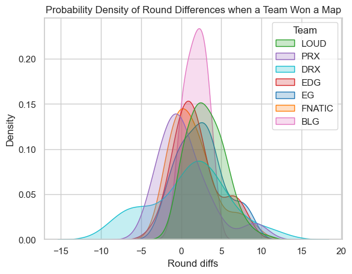
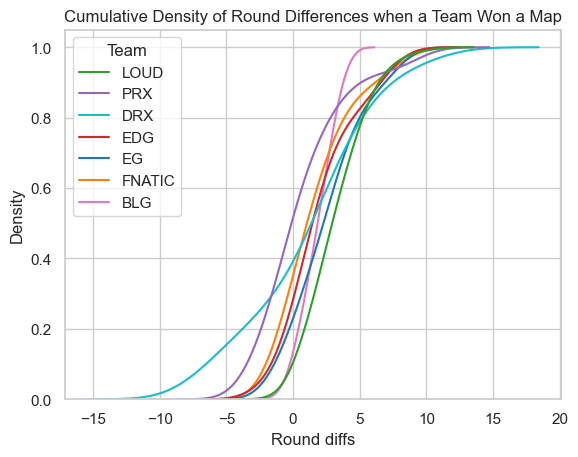
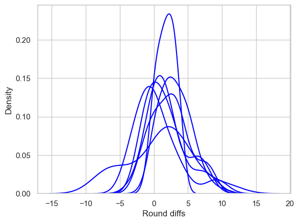
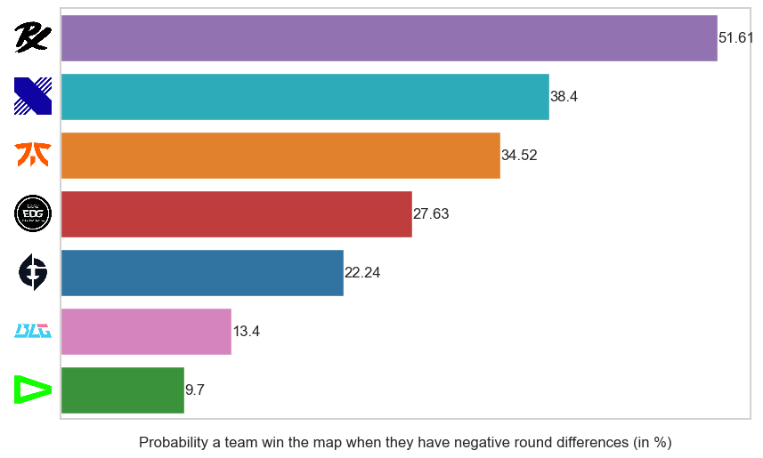
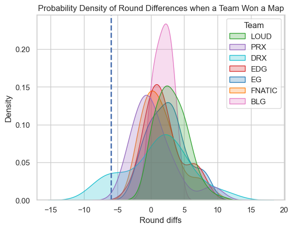
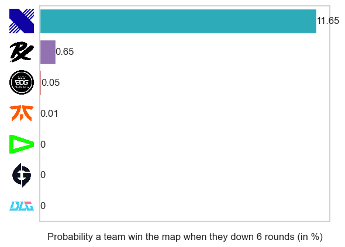

<script type="text/x-mathjax-config">
    MathJax.Hub.Config({
        tex2jax: {
        skipTags: ['script', 'noscript', 'style', 'textarea', 'pre'],
        inlineMath: [['$','$']]
        }
    });
    </script>
      
<script type="text/javascript" async src="https://cdn.mathjax.org/mathjax/latest/MathJax.js?config=TeX-MML-AM_CHTML"> </script>

***

# VCT 2023 Champions Analysis

**Probability a team wins win a map**

*Posted on August 2023*

***

I am interested in finding the probability of a team win a map in VCT Champions. Prior to this, I realized that Paperrex (PRX), usually perform a comeback and won a map. So, I want to analyze the probability of a team won a map based on their round difference.


```python
import pandas as pd
import numpy as np
import seaborn as sns
import matplotlib.pyplot as plt
from IPython.display import Image, display
from matplotlib.offsetbox import OffsetImage, AnnotationBbox
```


```python
data_path = "VCT2023_rounddiffs_team_map_playoff_data.xlsx"

df = pd.read_excel(data_path, index_col=None)
df.head()
```


<div>
<style scoped>
    .dataframe tbody tr th:only-of-type {
        vertical-align: middle;
    }

    .dataframe tbody tr th {
        vertical-align: top;
    }

    .dataframe thead th {
        text-align: right;
    }
</style>
<table border="1" class="dataframe">
  <thead>
    <tr style="text-align: right;">
      <th></th>
      <th>Team</th>
      <th>Round diffs</th>
      <th>Map</th>
    </tr>
  </thead>
  <tbody>
    <tr>
      <th>0</th>
      <td>LOUD</td>
      <td>0</td>
      <td>Ascent</td>
    </tr>
    <tr>
      <th>1</th>
      <td>LOUD</td>
      <td>1</td>
      <td>Ascent</td>
    </tr>
    <tr>
      <th>2</th>
      <td>LOUD</td>
      <td>2</td>
      <td>Ascent</td>
    </tr>
    <tr>
      <th>3</th>
      <td>LOUD</td>
      <td>3</td>
      <td>Ascent</td>
    </tr>
    <tr>
      <th>4</th>
      <td>LOUD</td>
      <td>4</td>
      <td>Ascent</td>
    </tr>
  </tbody>
</table>
</div>


```python
df.dtypes
```


    Team           object
    Round diffs     int64
    Map            object
    dtype: object


```python
sns.set_theme(style='whitegrid')
palette = {"LOUD":"tab:green",
           "PRX":"tab:purple",
           "DRX":"tab:cyan",
           "EDG":"tab:red",
           "EG":"tab:blue",
           "FNATIC":"tab:orange",
           "BLG":"tab:pink"}
sns.kdeplot(data=df, x="Round diffs", hue="Team", fill=True, common_norm=False, palette=palette).set(title="Probability Density of Round Differences when a Team Won a Map")
```


    [Text(0.5, 1.0, 'Probability Density of Round Differences when a Team Won a Map')]


    

    


```python
sns.kdeplot(data=df, x="Round diffs", hue="Team", cumulative=True, common_norm=False, palette=palette).set(title="Cumulative Density of Round Differences when a Team Won a Map")
```


    [Text(0.5, 1.0, 'Cumulative Density of Round Differences when a Team Won a Map')]


    

    


## Probability a team win the map when they have negative round differences

To obtain the probability, I used kernel density estimation to estimate the distribution of teams winning a map based on their round difference. Then I caculate the area under the curve that is less than 0.


```python
# Probability winning a negative round diffs
teams = df["Team"].unique()
probability = []

for team in teams:
  ax = sns.kdeplot(data=df[df["Team"] == team], x="Round diffs",common_norm=False, color="blue")
  # Get all the lines used to draw the density curve
  kde_lines = ax.get_lines()[-1]
  kde_x, kde_y = kde_lines.get_data()

  # Mask area under the curve that less than 0
  mask = kde_x < 0
  filled_x, filled_y = kde_x[mask], kde_y[mask]

  # Area of less than 0
  area = np.round(np.trapz(filled_y, filled_x)*100, 2)
  probability.append(area)
```


    

    


```python
result = pd.DataFrame([teams, probability]).T
result.columns = ["Team", "Probability a team win the map when they have negative round differences (in %)"]
result.sort_values(by="Probability a team win the map when they have negative round differences (in %)", ascending=False, inplace=True)
fig, ax = plt.subplots(figsize=(10, 6))
ax = sns.barplot(data=result, x="Probability a team win the map when they have negative round differences (in %)", y="Team", palette=palette)

images = [plt.imread(team + ".png") for team in result["Team"]]
tick_labels = ax.yaxis.get_ticklabels()

ax.set(yticklabels=[])
ax.set(xticklabels=[])
ax.set(ylabel=None)
ax.grid(False)

for i in ax.containers:
    ax.bar_label(i,)

for i,image in enumerate(images):
    ib = OffsetImage(image, zoom=.15)
    ib.image.axes = ax
    ab = AnnotationBbox(ib,
                    tick_labels[i].get_position(),
                    frameon=False,
                    box_alignment=(1.25, 0.5)
                    )
    ax.add_artist(ab)
```


    

    


In general as I hypothesize earlier, PRX has the highest probability to win a map when they down a round followed by DRX.

## Probability a team win the map when they have -6 round differences


```python
# Probability winning a -6 round difference
teams = df["Team"].unique()
probability = []

for team in teams:
  ax = sns.kdeplot(data=df[df["Team"] == team], x="Round diffs",common_norm=False, color="blue")
  # Get all the lines used to draw the density curve
  kde_lines = ax.get_lines()[-1]
  kde_x, kde_y = kde_lines.get_data()

  # Mask area under the curve that less than -6
  mask = kde_x < -6
  filled_x, filled_y = kde_x[mask], kde_y[mask]

  # Area of less than -6
  area = np.round(np.trapz(filled_y, filled_x)*100, 2)
  #print("The probability that {} won a map when experiences 9-3 curse is: {}%".format(team, area))
  probability.append(area)
```


    

    


```python
sns.set_theme(style='whitegrid')
sns.kdeplot(data=df, x="Round diffs", hue="Team", fill=True, common_norm=False, palette=palette).set(title="Probability Density of Round Differences when a Team Won a Map")
plt.axvline(x=-6, linewidth=2, linestyle='--')
```


    <matplotlib.lines.Line2D at 0x29be734c990>


    

    


```python
result = pd.DataFrame([teams, probability]).T
result.columns = ["Team", "Probability a team win the map when they down 6 rounds (in %)"]
result.sort_values(by="Probability a team win the map when they down 6 rounds (in %)", ascending=False, inplace=True)
ax = sns.barplot(data=result, x="Probability a team win the map when they down 6 rounds (in %)", y="Team", palette=palette)

images = [plt.imread(team + ".png") for team in result["Team"]]
tick_labels = ax.yaxis.get_ticklabels()

ax.set(yticklabels=[])
ax.set(xticklabels=[])
ax.set(ylabel=None)
ax.grid(False)

for i in ax.containers:
    ax.bar_label(i,)

for i,image in enumerate(images):
    ib = OffsetImage(image, zoom=.15)
    ib.image.axes = ax
    ab = AnnotationBbox(ib,
                    tick_labels[i].get_position(),
                    frameon=False,
                    box_alignment=(1.25, 0.5)
                    )
    ax.add_artist(ab)
```


    

    


However, when we consider a "comeback" though (here I defined a comeback as winning with less than -6 round differences), DRX takes the spot. However, DRX is skewed because they have one match against BLG in which they comeback from -10 round differences.
